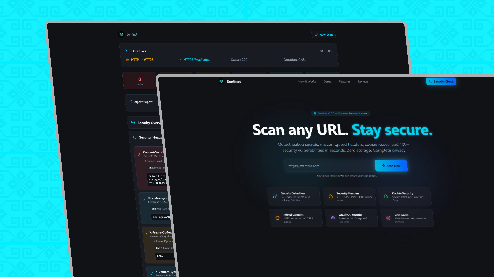

# Sentinel — Stateless Security Scanner

**[Live Demo](https://sentinel-caseinn.vercel.app/)** | **[GitHub Repository](https://github.com/Caseinn/sentinel)**

A **stateless security scanner** that analyzes any URL for leaked secrets, misconfigured headers, and vulnerabilities.  
Zero storage. Complete privacy. 100+ security checks in seconds.

> 🔍 **Instant Analysis** • **Zero Data Retention** • **100+ Security Checks**

---

## 🎯 Key Features

- **🔐 Secrets Detection**  
  Detects 50+ patterns including Stripe, AWS, GitHub, OpenAI, JWT, database URLs, Slack webhooks, NPM tokens, and more.

- **🛡️ Security Headers Analysis**  
  Checks 12 critical headers: CSP, HSTS, X-Frame-Options, X-Content-Type-Options, Referrer-Policy, Permissions-Policy, COOP, CORP, COEP, and more.

- **🍪 Cookie Security**  
  Validates Secure, HttpOnly, and SameSite flags. Identifies unprotected session cookies.

- **🌐 Mixed Content Detection**  
  Finds HTTP resources (scripts, styles, images, iframes) loaded on HTTPS pages.

- **📡 GraphQL Security**  
  Detects exposed GraphQL endpoints with introspection enabled.

- **🔎 Technology Fingerprinting**  
  Identifies 100+ frameworks, servers, CDNs, databases, analytics, and third-party services.

---

## 🔒 Security-First Design

- **Zero Data Retention**: Scan results exist only in your browser
- **No Accounts Required**: Paste a URL, get instant results
- **Input Validation**: Blocks localhost, private IPs, and dangerous URL schemes
- **Strict CSP**: Content-Security-Policy with object-src 'none', base-uri, form-action
- **No Server-Side Storage**: All analysis happens in real-time

---

## 🚀 Quick Start

```bash
# 1. Clone repo
git clone https://github.com/Caseinn/sentinel.git
cd sentinel

# 2. Install dependencies
npm install

# 3. Run development server
npm run dev

# 4. Open http://localhost:3000
```

---

## 📦 Build for Production

```bash
# Build the application
npm run build

# Start production server
npm start
```

---

## 📋 Scanner Checks

| Category | Checks |
|----------|--------|
| Secrets Detection | 50+ patterns (API keys, tokens, DB URLs, webhooks) |
| Security Headers | CSP, HSTS, X-Frame, X-Content-Type, Referrer-Policy, Permissions-Policy, COOP, CORP, COEP |
| Cookie Security | Secure, HttpOnly, SameSite flags |
| Mixed Content | HTTP resources on HTTPS pages |
| GraphQL Security | Introspection detection, endpoint exposure |
| Tech Stack | 100+ framework/server/service signatures |

---

## 📄 License

MIT License — Free to use, modify, and distribute.

> Created by **[Dito Rifki Irawan](https://instagram.com/ditorifkii)**  

---

## ❤️ Support

If Sentinel helps secure your applications:
- ⭐ Star the repository
- 🔗 Follow [@ditorifkii on Instagram](https://instagram.com/ditorifkii)
- 🐙 Explore more on [GitHub @Caseinn](https://github.com/Caseinn)

---
